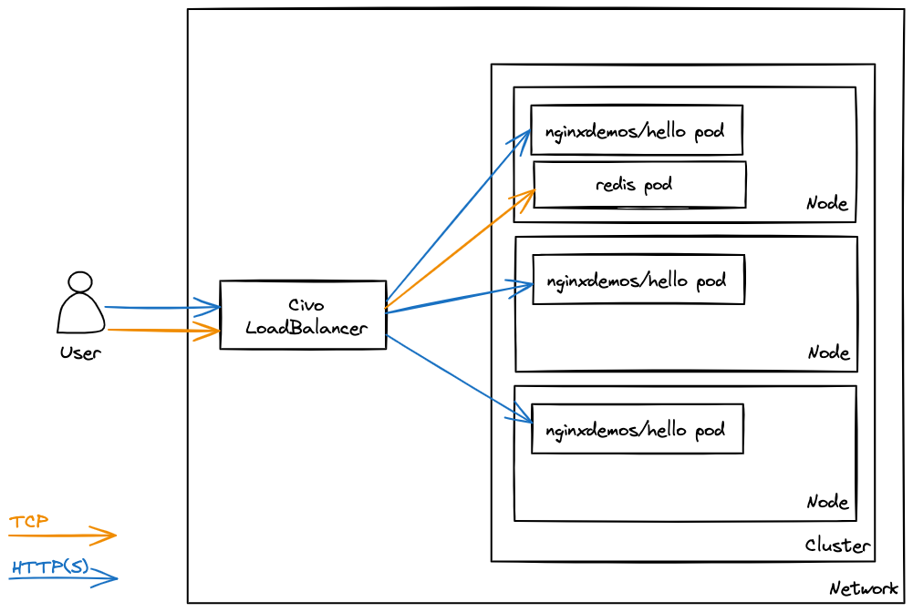

## About

A short guide on how to use Ingress Nginx Helm Chart to expose the following ports using Civo LoadBalancer.

- 80 (HTTP)
- 443 (HTTPS)
- 6379 (TCP)



## Steps

1. Clone this repo

    ```
    $ git clone https://github.com/zulh-civo/ingress-nginx-tcp-svc-civo.git
    ```

2. Change directory to clone repo

    ```
    $ cd /path/to/cloned/repo
    ```

3. Create a cluster using [Civo CLI](https://www.civo.com/docs/overview/civo-cli)

    > Feel free to change the cluster name (it's `demo` in this case)

    ```
    $ civo k8s create demo --remove-applications=traefik2-nodeport,metrics-server --wait
    ```

    > This step may take around 2-3 minutes

4. When the cluster is ready, download the kubeconfig

    ```
    $ civo k8s config demo --save --local-path ~/Desktop/demo-kubeconfig
    ```

5. Set kubeconfig

    ```
    $ export KUBECONFIG=~/Desktop/demo-kubeconfig
    ```

6. (Optional) - Confirm the nodes

    > `k` is alias for `kubectl`

    ```
    $ k get nodes -o wide
    NAME                                        STATUS   ROLES    AGE     VERSION        INTERNAL-IP   EXTERNAL-IP      OS-IMAGE             KERNEL-VERSION   CONTAINER-RUNTIME
    k3s-demo-89e4-080a25-node-pool-2aec-5rx73   Ready    <none>   2m51s   v1.28.7+k3s1   192.168.1.3   131.153.226.68   Alpine Linux v3.18   6.1.87-0-virt    containerd://1.7.11-k3s2
    k3s-demo-89e4-080a25-node-pool-2aec-p2tyb   Ready    <none>   2m50s   v1.28.7+k3s1   192.168.1.4   <none>           Alpine Linux v3.18   6.1.87-0-virt    containerd://1.7.11-k3s2
    k3s-demo-89e4-080a25-node-pool-2aec-chi9o   Ready    <none>   2m54s   v1.28.7+k3s1   192.168.1.5   <none>           Alpine Linux v3.18   6.1.87-0-virt    containerd://1.7.11-k3s2
    ```

7. Install Ingress Nginx Helm chart

    ```
    $ helm upgrade --install ingress-nginx ingress-nginx --repo https://kubernetes.github.io/ingress-nginx --namespace ingress-nginx --create-namespace --values ingress-nginx-helm-values.yaml
    ```

    > This step may take around 2-3 minutes

8. Confirm Helm release

    ```
    $ helm ls -A
    NAME         	NAMESPACE    	REVISION	UPDATED                             	STATUS  	CHART               	APP VERSION
    ingress-nginx	ingress-nginx	1       	2025-01-06 15:48:24.985948 +0800 +08	deployed	ingress-nginx-4.12.0	1.12.0
    ```

9. Confirm Ingress Nginx ConfigMaps

    ```
    $ k -n ingress-nginx get cm | grep ingress
    ingress-nginx-controller   0      97s # not important for this demo
    ingress-nginx-tcp          1      97s # important for this demo

    $ k -n ingress-nginx get cm ingress-nginx-tcp -o yaml
    apiVersion: v1
    data:
    "6379": redis/redis:6379
    kind: ConfigMap
    metadata:
    annotations:
        meta.helm.sh/release-name: ingress-nginx
        meta.helm.sh/release-namespace: ingress-nginx
    creationTimestamp: "2025-01-06T07:49:10Z"
    labels:
        app.kubernetes.io/component: controller
        app.kubernetes.io/instance: ingress-nginx
        app.kubernetes.io/managed-by: Helm
        app.kubernetes.io/name: ingress-nginx
        app.kubernetes.io/part-of: ingress-nginx
        app.kubernetes.io/version: 1.12.0
        helm.sh/chart: ingress-nginx-4.12.0
    name: ingress-nginx-tcp
    namespace: ingress-nginx
    resourceVersion: "1009"
    uid: 604610db-d765-46e1-9c2c-7b2a2589f952
    ```

10. Confirm Ingress Nginx Deployment

    > Make sure the following flag is set on `controller` container

    ```
    $ k -n ingress-nginx get deployment ingress-nginx-controller -o yaml
    ...
    - args:
        - /nginx-ingress-controller
        ...
        - --tcp-services-configmap=$(POD_NAMESPACE)/ingress-nginx-tcp
        ...
    ...
    ```

11. Copy LoadBalancer hostname:

    ```
    $ k -n ingress-nginx get svc ingress-nginx-controller -o yaml | grep hostname
    - hostname: 2d5a7170-b21b-4c78-a31f-c7c875eab1e6.lb.civo.com
    ```

12. Open _manifests.yaml_ name in your favourite edit and change `<LB_DNS>` parts with hostname from previous step e.g.

    ```
    - host: "nginx.2d5a7170-b21b-4c78-a31f-c7c875eab1e6.lb.civo.com"
    - host: "redis.2d5a7170-b21b-4c78-a31f-c7c875eab1e6.lb.civo.com"
    ```

13. Save and apply the _manifests.yaml_ file

    ```
    $ k apply -f manifests.yaml
    ```

14. Confirm Ingress

    ```
    $ k get ing -A
    NAMESPACE   NAME    CLASS   HOSTS                                                    ADDRESS   PORTS   AGE
    nginx       nginx   nginx   nginx.2d5a7170-b21b-4c78-a31f-c7c875eab1e6.lb.civo.com             80      13s
    redis       redis   nginx   redis.2d5a7170-b21b-4c78-a31f-c7c875eab1e6.lb.civo.com             80      10s
    ```

15. Test HTTP/HTTPS application

    ```
    $ curl nginx.2d5a7170-b21b-4c78-a31f-c7c875eab1e6.lb.civo.com
    Server address: 10.42.1.4:80
    Server name: nginx-56f949f457-fnjpt
    Date: 06/Jan/2025:08:01:18 +0000
    URI: /
    Request ID: 1e511156568fd2f4038bcfffc8c5f2f7

    $ curl nginx.2d5a7170-b21b-4c78-a31f-c7c875eab1e6.lb.civo.com
    Server address: 10.42.2.3:80
    Server name: nginx-56f949f457-v485g
    Date: 06/Jan/2025:08:01:20 +0000
    URI: /
    Request ID: 0aa15a4568ef9995556663f55b206511

    $ curl nginx.2d5a7170-b21b-4c78-a31f-c7c875eab1e6.lb.civo.com
    Server address: 10.42.0.4:80
    Server name: nginx-56f949f457-x76cb
    Date: 06/Jan/2025:09:18:27 +0000
    URI: /
    Request ID: fe1acbf589ac51d36940fa30865d1434
    ```

    The `Server name` lines should correspond to Pod names in the `nginx` namespace:

    ```
    $ k -n nginx get pods
    NAME                     READY   STATUS    RESTARTS   AGE
    nginx-56f949f457-v485g   1/1     Running   0          76m
    nginx-56f949f457-x76cb   1/1     Running   0          76m
    nginx-56f949f457-fnjpt   1/1     Running   0          76m
    ```

16. Test TCP application

    ```
    # Using LB IP
    $ export LB_IP=$(k -n ingress-nginx get svc ingress-nginx-controller -o json | jq -r '.status.loadBalancer.ingress[0].ip')

    $ echo $LB_IP
    131.153.226.123

    $ redis-cli -h $LB_IP
    131.153.226.123:6379> PING
    PONG
    131.153.226.123:6379> exit
    ```

    ```
    # Using Ingress (subject to DNS propagation)
    $ redis-cli -h redis.2d5a7170-b21b-4c78-a31f-c7c875eab1e6.lb.civo.com
    redis.2d5a7170-b21b-4c78-a31f-c7c875eab1e6.lb.civo.com:6379> ping
    PONG
    redis.2d5a7170-b21b-4c78-a31f-c7c875eab1e6.lb.civo.com:6379> exit
    ```
